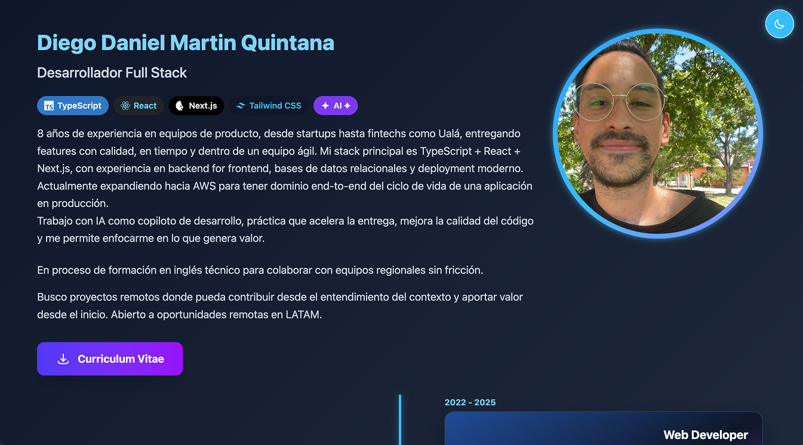

# 👋 Hola

 

### 💻 Senior Developer

---

## 🧉 Sobre mí

**Desarrollador web** con veteranía en **React** y **Next.js**, formando parte de equipos de desarrollo ágil, donde combino mi experiencia técnica con liderazgo, enfocándome en soluciones escalables de calidad.

## 🛠️ Stack tecnológico

---

_"play development, create tomorrow, craft experiences"_ ✨

**desarrollado con copilot 🧠**

